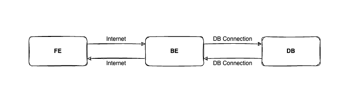

# How to debug? FE Bug or BE Bug
Giả sử, bạn đang làm trong dự án về E-commerce và nhận được 1 report từ khách hàng.
- "Nút thay đổi trạng thái vận chuyển không hoạt động được".

Đối với DEV, bạn cần phải làm gì?

## Phân tích vấn đề
Để giải quyết được vấn đề thì mình cần phải hiểu vấn đề trước nhưng khách hàng report chỉ 1 vài câu đơn giản như "không hoạt động" thì khá ít thông tin để mà có thể tái hiện lỗi ở DEV, STG, v.v...

Đa số khách hàng đều là người sử dụng ứng dụng hay nói thẳng là non-tech. Mình không thể dùng ngôn ngữ dev để nói chuyện hay yêu cầu nhiều thông tin hơn từ khách hàng. Việc này khá là khó khăn. Vậy phân tích bắt đầu từ đâu?

Về tổng quan, khách hàng sẽ thực hiện hành động của mình trên FE.
BE sẽ xử lý dữ liệu và lưu vào DB sau đó trả về cho FE hiển thị.

FE sẽ kết nối với BE thông qua internet connection. BE sẽ kết nối với DB thông qua DB connection. Khi nhìn được tổng quan, dev sẽ đi điều tra để tìm nguyên nhân.

### FE Bug
- Không xử lý action cho các HTML element
- Không hiển thị đúng dữ liệu từ BE gửi về

### BE Bug
- Không validate dữ liệu từ FE gửi lên
- Không trả về kết quả cho FE
- Code logic sai
- Không kết nối được DB

### DB
- Server DB chưa start hoặc bị stop vì lý do nào đó.

### Internet
Nếu sau khi kiểm tra, mọi thứ đều đúng thì lý do có thể rơi vào mạng internet, netwwork...
- IP bị block: Chỉ cho phép IP Nhật vào nhưng lỡ bay sang Hàn nên không vào được
- Mạng bị chậm dẫn đến timeout.

### Other
Ngoài ra, khách hàng có thể đã sử dụng các tool bên ngoài và vô tình chặn request như Adblocks

## Kết
Sau khi nhìn được toàn cảnh thì việc điều tra nguyên nhân sẽ dễ dàng hơn và đưa ra được hướng giải quyết.
Thay vì ngồi tranh nhau lỗi FE hay BE. 

